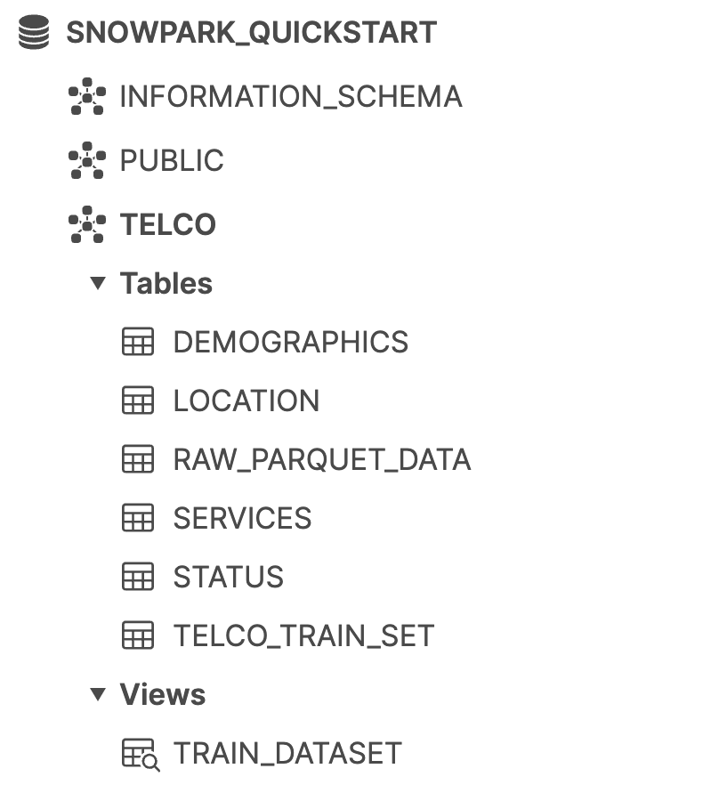

# ML pipeline with Snowpark
[Getting Started with Snowpark Python](https://quickstarts.snowflake.com/guide/getting_started_with_snowpark_python/index.html?index=..%2F..index#0)에 따라 구현

## Snowpark-python


## Use-Case
Predicting Customer Churn: 고객이타률을 줄이기 위한 솔루션을 제공

## Steps

### generate config.py
아래 정보를 기반으로 `config.py`를 작성하여 추가한다.
```python
snowflake_conn_prop = {
   "account": "<account>",
   "user": "<user>",
   "password": "<password>",
   "role": "ACCOUNTADMIN",
   "database": "snowpark_quickstart",
   "schema": "TELCO",
   "warehouse": "TEST_WH",
}
```


### setup environment
```console
$ conda env create -f jupyter_env.yml
$ conda activate snowpark-python
$ python -m ipykernel install --user --name=snowpark-python
```

### enable anaconda packages in snowflake
[Using Third-Party Packages from Anaconda](https://docs.snowflake.com/en/developer-guide/udf/python/udf-python-packages.html#using-third-party-packages-from-anaconda)

### Build ML pipeline with snowpark
1. load-data
2. eda
3. ml-pipeline

## Results 

tables

