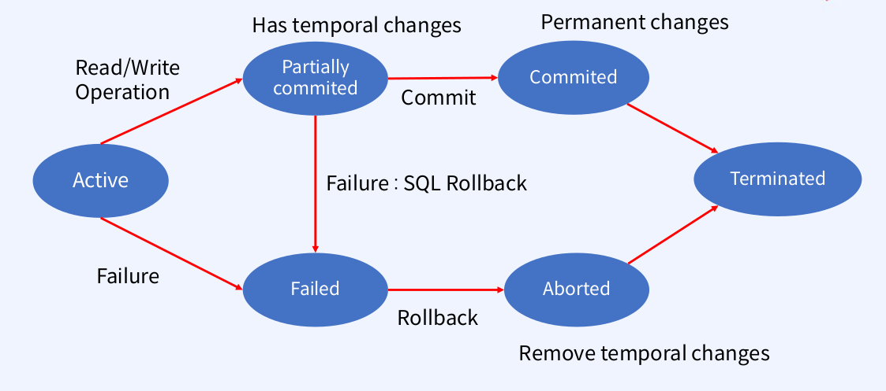

*Concept - Database*

# Transaction
Transaction state의 흐름은 아래와 같다.

- *partially commited* : read/write operation이 들어오면 임시적으로 저장된다. Commit이 되면 데이터는 영구적으로 저장되고, operation이 실패하면 Rollback되어 임시 저장된 데이터는 삭제된다.

- *serial( serializable ) schedule과* : 트랜젹션은 operation 순서를 정해서 하나씩 순차적으로 실행된다. 생성된 트랜잭션 스케줄이 serial schedule과 동일할 때 *serializable*라고 한다. serial schedule으 Conflict Serializability, View Serializability 2가지에 따라 변환된다. *Conflict Serializability*는 non-conflict operation의 순서를 바꿔 serial schedule로 변환시키는 것을 의미한다.

### Precedence Graph

스케줄의 conflict serializability을 테스트할 때 사용되는 그래프이다. 각 트랜잭션이 Graph의 노드라고 하고 트랜잭션 간 conflict가 있을 때 화살표( directed edge )로 표시한다. 만약 **cycle이 없다면 conflict serializable 스케줄**이 된다. 

위의 경우에는 cycle이 생기므로 conflict serializable 스케줄이 될 수 없다.  
**스케줄은 serializable을 만족해야 하며 복구 가능해야 한다.**

아래에서 T1 → T2 순의 트랜잭션이 있을 때 복구 불가능한 경우는 T1의 commit 전에 T2에서 commit이 되어 T1이 실패하면 일관성이 깨지게 된다. T1에서 commit 이후에 T2에서 commit을 해야 복구가 가능하다. 즉, **스케줄은 cascadeless해야 한다.**  

## COMMIT & ROLLBACK
트랜잭션은 COMMIT을 통해 완성된다.

***COMMIT, ROLLBACK 이전의 데이터는***
- 메모리 버퍼에만 영향을 받았기에 **데이터 변경 이전으로 복구 가능**하다.
- **현재** 사용자는 SELECT문으로 결과를 확인할 수 있다.
- **다른** 사용자는 현재 사용자가 수정한 결과를 확인할 수 없다.
- 변경된 행은 잠금이 걸려있어 다른 사용자가 **동시에 수정할 수 없다.**

COMMIT 이전이면 ROLLBACK을 통해 데이터 변경 사항이 취소되어 이전 상태로 복구된다.

***COMMIT 이후의 데이터는***
- 변경 사항이 DB에 반영된다.
- 이전 데이터는 폐기된다.
- **모든** 사용자는 결과를 확인할 수 있다.
- 관련된 행에 대한 잠금이 풀려 **다른 사용자가 수정할 수 있다.**

> 출처 : [[DATABASE] TCL 이란? COMMIT, ROLLBACK, SAVEPOINT](https://mozi.tistory.com/209)

# Recovery
복구 시스템은 다음을 만족시켜야 한다.

- *Atomicity* : 트랜잭션의 operation이 실행 중에 장애가 발생하면 rollback되어야 한다
- *Durability* : 장애 후에도 commit된 트랜잭션 데이터는 유지되어야 한다

PostgreSQL를 예로 들면, write-ahead log(WAL)를 활용한다. 

- 변경된 내용은 **디스크에 먼저 기록**한다( Atomicity 보장 )
- **Commit전에 모든 내용에 대한 기록**이 저장되어야 한다( Durability 보장 )

## WAL

- *UNDO* log : crash 후에 commit되지 않은 변경 사항은 UNDO( 취소 )  
    

    1. OLD값( A: 8, B: 8 )에 대한 로그를 기록한다.
    2. 변경 사항을 반영한 후 commit 로그를 flush한다.

- *REDO* log : crash 후에 commit된 변경 사항은 REDO( raplay )  
    

    1. NEW값( A: 16, B: 16 )에 대한 로그를 기록한다.
    2. commit 로그를 flush한 후 변경 사항을 반영한다.
    3. END log를 기록한다.